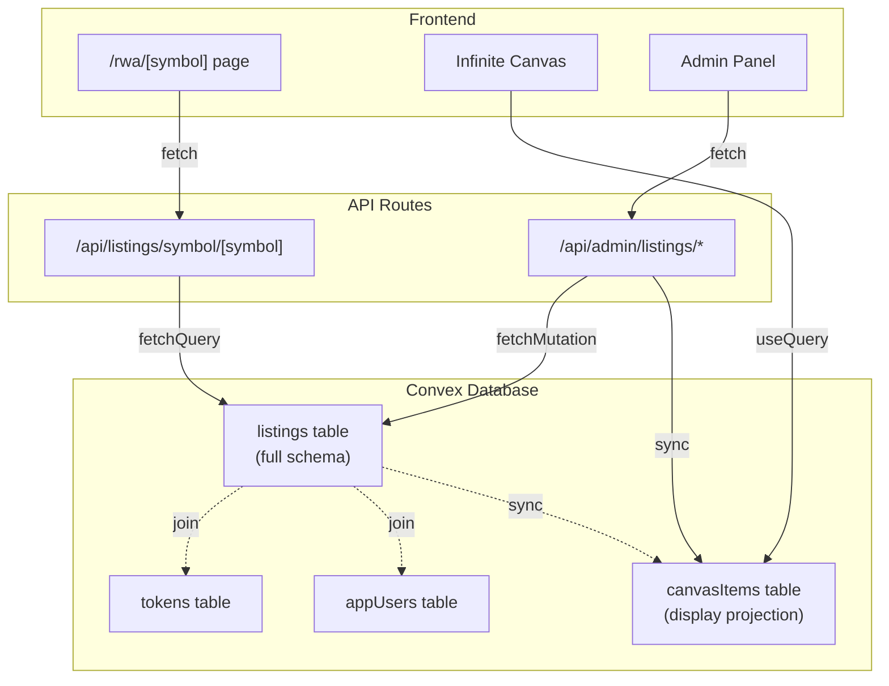

# Convex Listings Migration - Complete

## Summary

Successfully migrated the listings system from Supabase/Prisma to Convex. The RWA pages (`/rwa/[symbol]`) and admin listing management now use Convex as the source of truth.

## Changes Made

### 1. Convex Schema (`convex/schema.ts`)
- Added new `listings` table with full schema (30+ fields)
- Added indexes: `by_symbol`, `by_stable_id`, `by_ownerId`, `by_isLive`
- Added `by_listingId` index to `tokens` table for joins

### 2. Convex Queries (`convex/listings.ts`) - NEW FILE
Created comprehensive query and mutation functions:
- `getBySymbol` - Fetch listing by symbol with token + owner joins
- `getById` - Fetch listing by ID with token + owner joins
- `list` - List all listings with enriched data
- `insert` - Create/update listing (idempotent by id)
- `update` - Partial update listing
- `setLive` - Toggle isLive status
- `remove` - Delete listing

### 3. Convex Users (`convex/users.ts`)
- Added `list` query for admin panel to find admin users

### 4. API Routes Migrated to Convex

#### Listing Fetch Route
**File:** `src/app/api/listings/symbol/[symbol]/route.ts`
- Replaced `prisma.listing.findFirst()` with `fetchQuery(api.listings.getBySymbol)`
- Maps Convex document to `DatabaseListing` response shape
- Token health still works (uses Prisma for DexTrade data only)

#### Admin Listing Routes
**File:** `src/app/api/admin/listings/route.ts`
- GET: Uses `fetchQuery(api.listings.list)` instead of Prisma
- POST: Creates listing in Convex, links token via `tokens.insertToken`

**File:** `src/app/api/admin/listings/[id]/route.ts`
- PATCH: Updates listing via `fetchMutation(api.listings.update)`

**File:** `src/app/api/admin/listings/[id]/live/route.ts`
- PATCH: Toggles live status via `fetchMutation(api.listings.setLive)`

### 5. Backfill Script
**File:** `src/app/api/admin/backfill-listings/route.ts` - NEW FILE
- One-time migration endpoint to copy all listings from Prisma to Convex
- Preserves all fields including timestamps, relations, and JSON data

## Architecture



## Deployment Steps

### Step 1: Deploy Convex Schema Changes
```bash
cd apps/frontend
npx convex deploy --prod
```

This will push the new `listings` table schema to production Convex.

### Step 2: Backfill Existing Listings
After deploying the schema, run the backfill to copy existing listings from Supabase to Convex:

```bash
# Option A: Via curl (if you have admin auth token)
curl -X POST https://aces.fun/api/admin/backfill-listings \
  -H "Authorization: Bearer YOUR_ADMIN_TOKEN"

# Option B: Via browser console (while logged in as admin)
fetch('/api/admin/backfill-listings', { method: 'POST' })
  .then(r => r.json())
  .then(console.log)
```

### Step 3: Deploy Frontend Code
Deploy the updated API routes to Vercel:

```bash
# From repo root
git add .
git commit -m "Migrate listings from Supabase to Convex"
git push origin main
```

Vercel will automatically deploy the changes.

### Step 4: Verify
1. Visit `https://aces.fun/rwa/APKAWS` (or any live symbol)
2. Check browser console - the "Failed to fetch listing: 500" error should be gone
3. Verify the page loads with all listing data (images, story, details, token info)

## What Still Uses Prisma/Supabase

These services still use Prisma for now (can be migrated later if needed):
- **Token Metrics Service** - Reads `DexTrade` table for volume/fee calculations
- **Market Cap Service** - Reads token data for pool addresses
- **Comments System** - Still in Prisma (not migrated yet)

The token health endpoint (`includeHealth=1`) still works because it only needs the token contract address, which comes from Convex.

## Rollback Plan

If issues arise, you can rollback by:
1. Reverting the API route changes (restore Prisma queries)
2. Keeping the Convex schema (no harm in having the listings table)
3. The backfill is idempotent, so you can re-run it safely

## Notes

- The `canvasItems` table is kept as-is - it's a denormalized projection for canvas display
- Token linking works via `tokens.listingId` matching `listings.id`
- The sync flow is now: Convex listings → canvasItems (via `convex-sync.ts`)
- Comment count is hardcoded to 0 for now (comments are still in Prisma)
